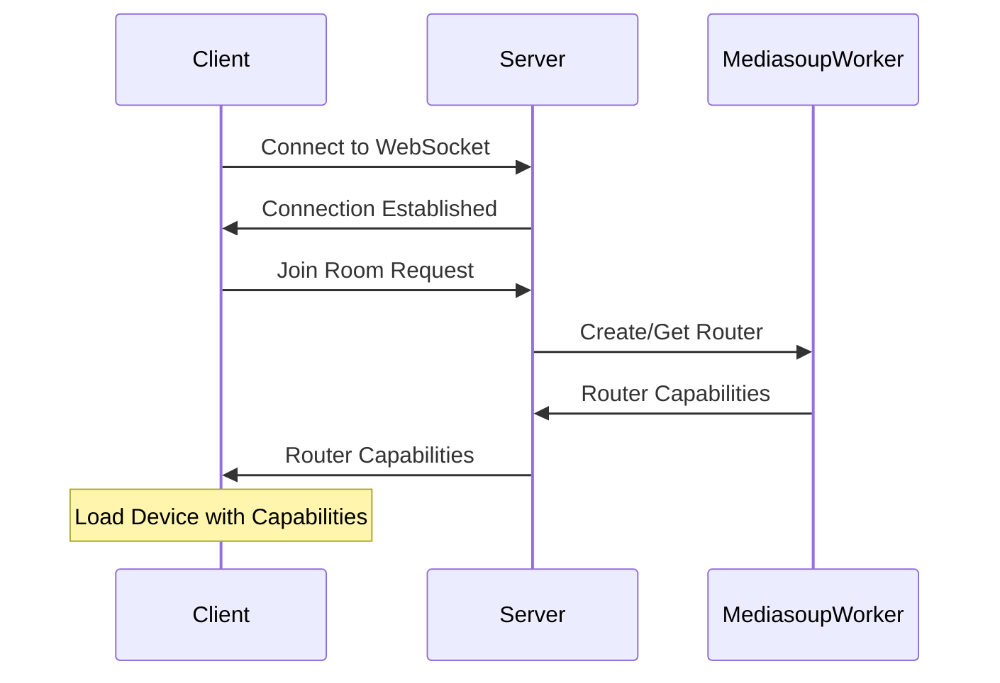
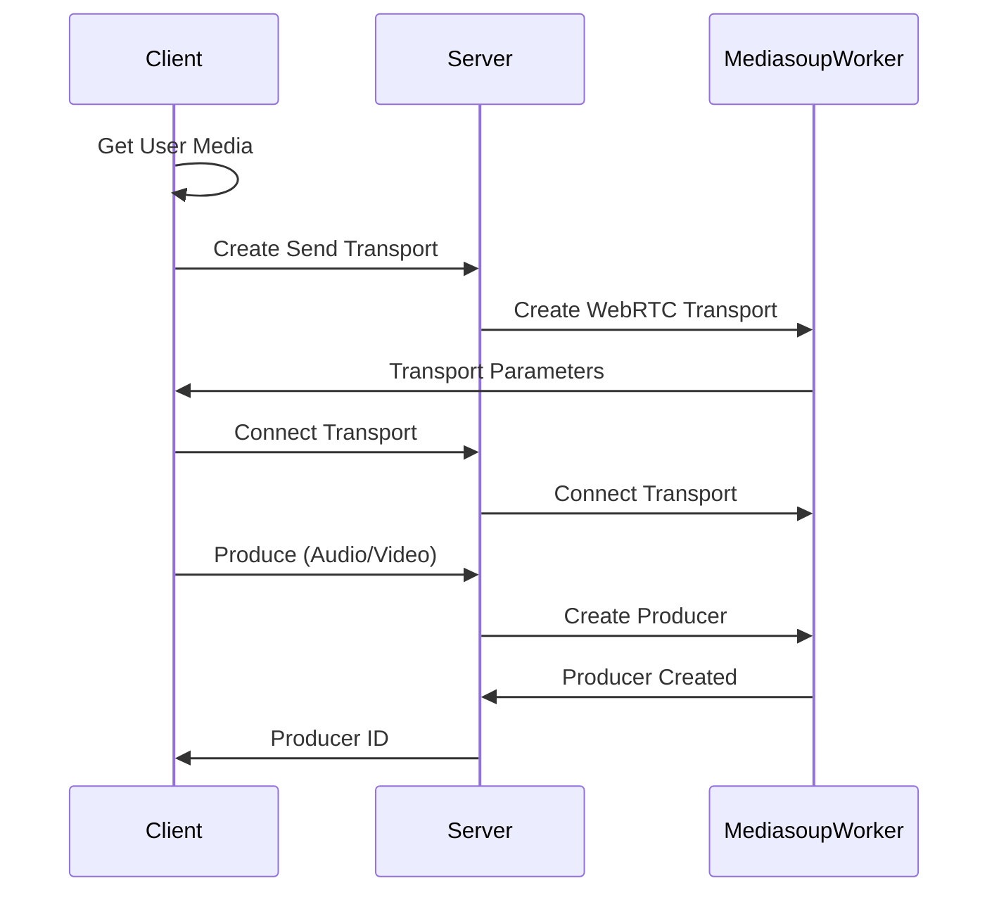
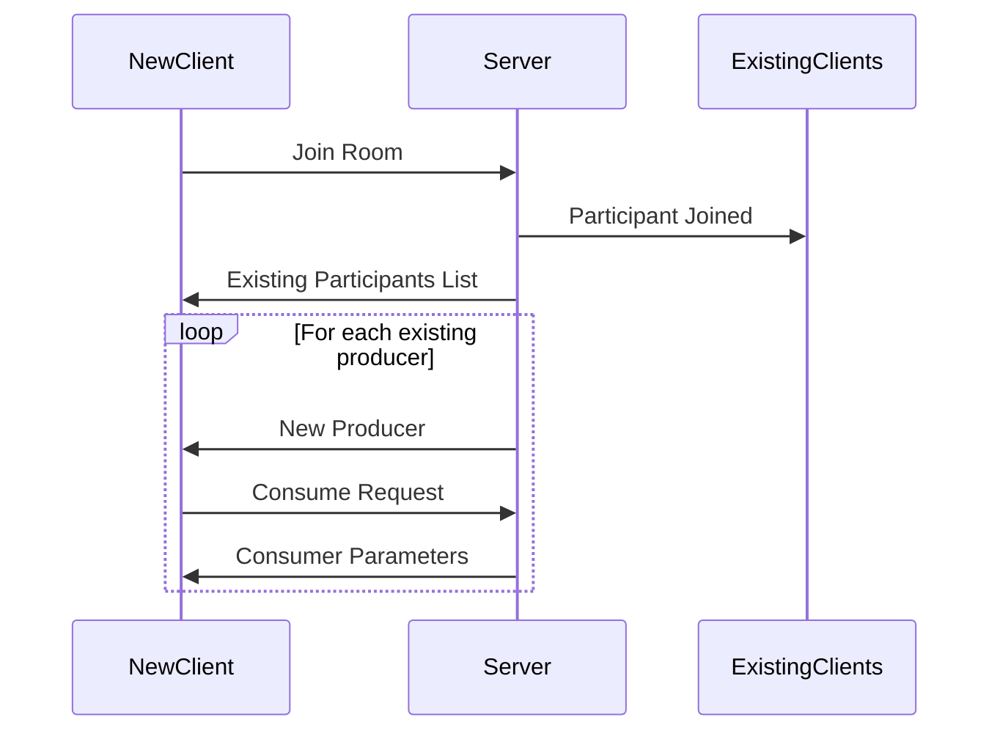
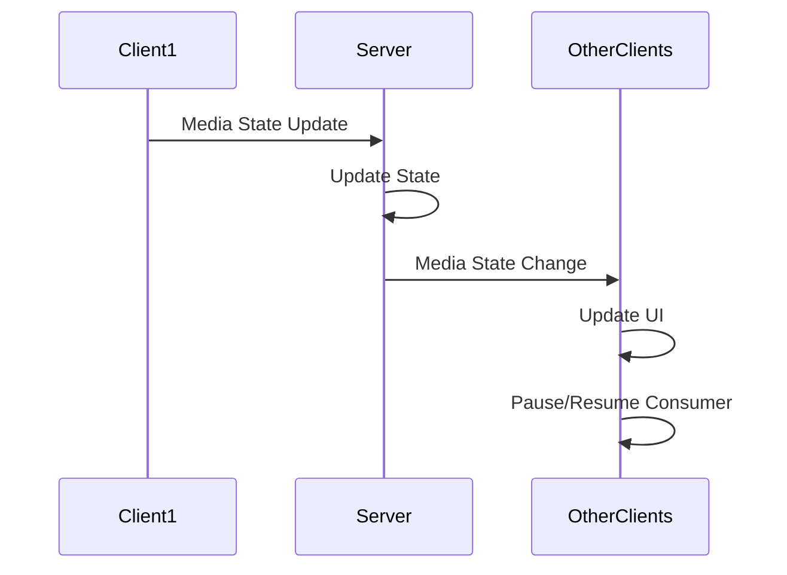
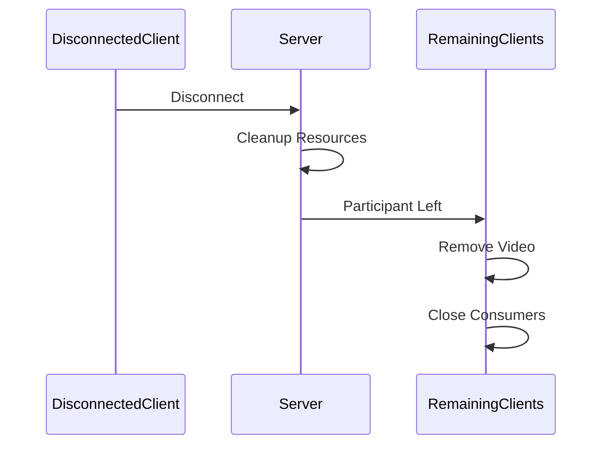

# Group Video Call Documentation

## Tổng quan

Dự án Group Video Call là một ứng dụng cho phép nhiều người dùng tham gia vào một phòng họp video và giao tiếp với nhau thông qua video/audio streams. 

### Tech Stack
- **Frontend**: React + TypeScript
- **Backend**: NestJS + WebSocket (Socket.IO)
- **Media Server**: Mediasoup

## Kiến trúc hệ thống

### 1. Frontend Components
- **VideoRoom**: Component chính quản lý UI của phòng họp
- **MediasoupService**: Service xử lý logic WebRTC và giao tiếp với server

### 2. Backend Services
- **MediasoupGateway**: Xử lý các WebSocket events và quản lý phòng họp
- **MediasoupService**: Quản lý Mediasoup workers, routers, transports và media streams

## Sơ đồ Flow

### 1. Initial Connection Flow


### 2. Media Connection Flow


### 3. Participant Join Flow


### 4. Media State Change Flow


### 5. Disconnect Flow


## Flow hoạt động chi tiết

### 1. Khởi tạo phòng và tham gia

1. **Client khởi tạo kết nối**:
```typescript
// Tạo instance của MediasoupService
const mediasoupService = new MediasoupService();

// Kết nối tới WebSocket server
socket = io("http://localhost:3000");
```

2. **Client yêu cầu tham gia phòng**:
```typescript
// Gửi request join-room với thông tin
await mediasoupService.setRoomId(roomId, participantId, username);
```

3. **Server xử lý yêu cầu tham gia**:
```typescript
@SubscribeMessage('join-room')
async handleJoinRoom(client: Socket, data: { 
  roomId: string, 
  participantId: string, 
  username: string 
}) {
  // Tạo phòng nếu chưa tồn tại
  await this.mediasoupService.createRoom(data.roomId);
  
  // Thêm participant vào phòng
  this.rooms.get(data.roomId)?.add(data.participantId);
  
  // Thông báo cho các user khác
  client.broadcast.to(data.roomId).emit('participant-joined', {
    participantId: data.participantId,
    username: data.username
  });
}
```

### 2. Thiết lập WebRTC Connection

1. **Khởi tạo MediasoupDevice trên client**:
```typescript
// Load device với router capabilities từ server
await device.load({ routerRtpCapabilities });
```

2. **Tạo Transport cho sending và receiving**:
```typescript
// Create send transport
const sendTransport = await mediasoupService.createSendTransport();

// Create receive transport (tự động khi cần)
const recvTransport = await mediasoupService.createRecvTransport();
```

3. **Produce local streams**:
```typescript
// Get local media
const stream = await navigator.mediaDevices.getUserMedia({
  video: true,
  audio: true
});

// Produce video track
const videoTrack = stream.getVideoTracks()[0];
await mediasoupService.produce(videoTrack, participantId, "video");

// Produce audio track
const audioTrack = stream.getAudioTracks()[0];
await mediasoupService.produce(audioTrack, participantId, "audio");
```

### 3. Xử lý Remote Participants

1. **Nhận thông báo về participant mới**:
```typescript
socket.on('participant-joined', (data: { 
  participantId: string, 
  username: string 
}) => {
  // Hiển thị thông tin participant mới
});
```

2. **Xử lý new producer từ participant khác**:
```typescript
socket.on('new-producer', async (data: {
  producerId: string,
  participantId: string,
  kind: 'audio' | 'video'
}) => {
  // Tạo consumer cho producer mới
  const consumer = await consumeStream(
    data.producerId,
    data.participantId,
    data.kind
  );
  
  // Hiển thị stream
  if (consumer) {
    displayStream(consumer, data.participantId, data.kind);
  }
});
```

### 4. Media Controls

1. **Toggle Audio/Video**:
```typescript
// Disable/Enable audio
async function toggleAudio() {
  const enabled = !isAudioEnabled;
  await mediasoupService.updateMediaState("audio", enabled);
}

// Disable/Enable video
async function toggleVideo() {
  const enabled = !isVideoEnabled;
  await mediasoupService.updateMediaState("video", enabled);
}
```

2. **Xử lý media state changes**:
```typescript
socket.on('media-state-change', (data: {
  participantId: string,
  kind: string,
  enabled: boolean
}) => {
  // Update UI để hiển thị trạng thái media của participant
});
```

### 5. Cleanup và Disconnect

1. **Rời phòng**:
```typescript
async function leaveRoom() {
  // Dọn dẹp local streams
  if (stream) {
    stream.getTracks().forEach(track => track.stop());
  }
  
  // Dọn dẹp remote streams
  cleanupAllRemoteStreams();
  
  // Thông báo server
  await mediasoupService.leaveRoom();
}
```

2. **Xử lý participant rời phòng**:
```typescript
socket.on('participant-left', (data: { participantId: string }) => {
  // Dọn dẹp resources của participant
  cleanupParticipantResources(data.participantId);
});
```

3. **Xử lý disconnect**:
```typescript
socket.on('disconnect', () => {
  // Dọn dẹp tất cả resources
  cleanupAllResources();
});
```

## Xử lý lỗi và Recovery

1. **Kết nối lại sau khi mất kết nối**:
- Client tự động thử kết nối lại với server
- Kiểm tra và đồng bộ lại danh sách participants
- Tái thiết lập media streams nếu cần

2. **Xử lý lỗi media**:
- Theo dõi trạng thái của tracks
- Thử lại kết nối media khi gặp lỗi
- Thông báo cho user về vấn đề với media

## Best Practices

1. **Performance**:
- Sử dụng WebRTC stats để monitor quality
- Optimize video resolution dựa trên network conditions
- Cleanup resources khi không sử dụng

2. **Security**:
- Validate tất cả input từ client
- Sử dụng DTLS cho media transport
- Kiểm tra quyền truy cập phòng

3. **UX**:
- Hiển thị loading states
- Thông báo rõ ràng về lỗi
- Tự động recovery khi có thể

## Deployment Considerations

1. **Server Requirements**:
- Node.js 14+
- Mediasoup system requirements
- Đủ CPU cho video processing

2. **Network**:
- Configure TURN servers
- Open necessary ports
- Handle NAT traversal

3. **Scaling**:
- Multiple Mediasoup workers
- Load balancing
- Room distribution

## Cài đặt và Chạy

### Backend

1. Di chuyển vào thư mục server:
```bash
cd server
```

2. Cài đặt dependencies:
```bash
yarn
```

3. Chạy server:
```bash
yarn start:dev
```

Server sẽ chạy tại `http://localhost:3000`

### Frontend

1. Di chuyển vào thư mục client:
```bash
cd client
```

2. Cài đặt dependencies:
```bash
yarn
```

3. Chạy ứng dụng:
```bash
yarn dev
```

Client sẽ chạy tại `http://localhost:5173`

### Sử dụng

1. Mở trình duyệt và truy cập `http://localhost:5173`
2. Nhập tên phòng muốn tham gia
3. Cho phép trình duyệt truy cập camera và microphone
4. Bạn có thể mở nhiều tab để test với nhiều người dùng khác nhau
